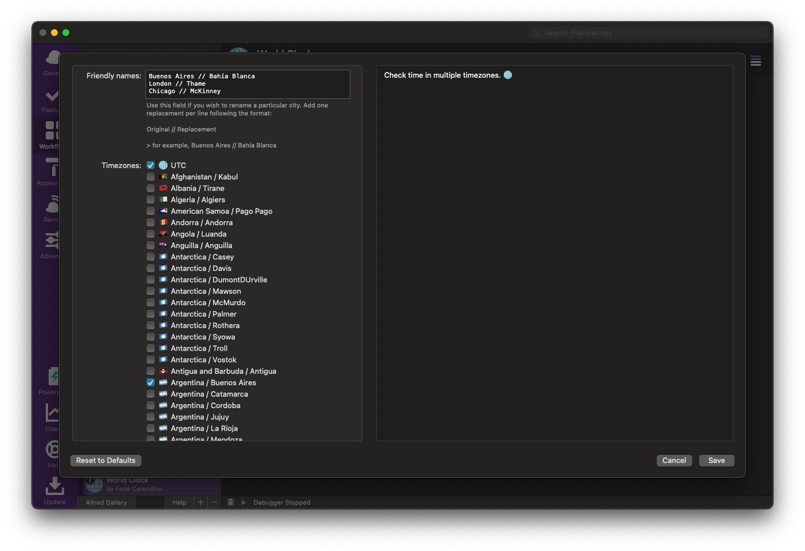
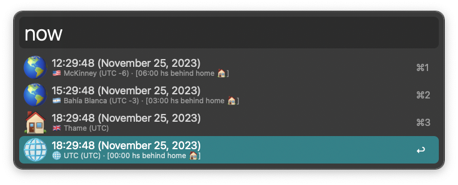
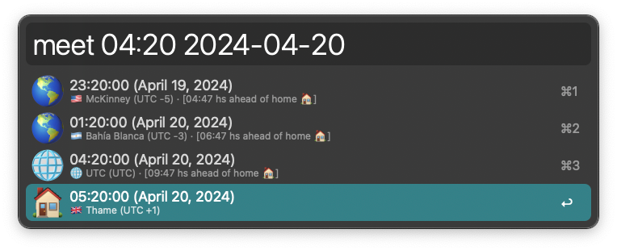
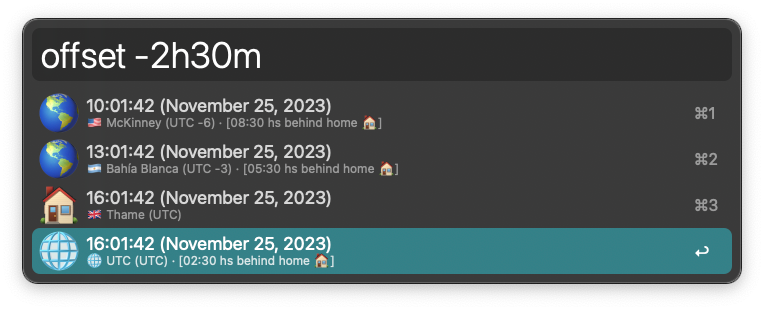

## ALFRED-WORLD-CLOCK

[Alfred Workflow](https://www.alfredapp.com/workflows/) to check time in multiple timezones. 🌐️

> timezone data provided by [timezonedb](https://timezonedb.com).

#### Configuration:

##### Friendly names

#### Usage:

##### Now

##### Meet

##### Offset

