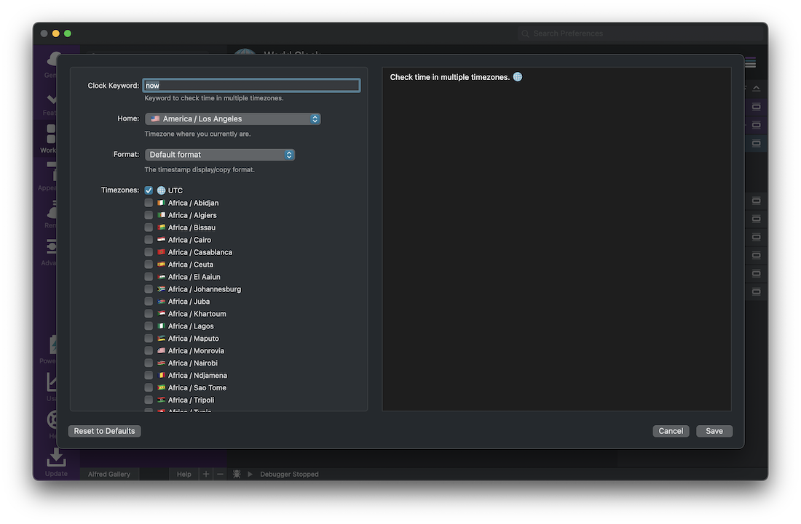
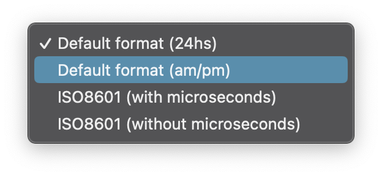
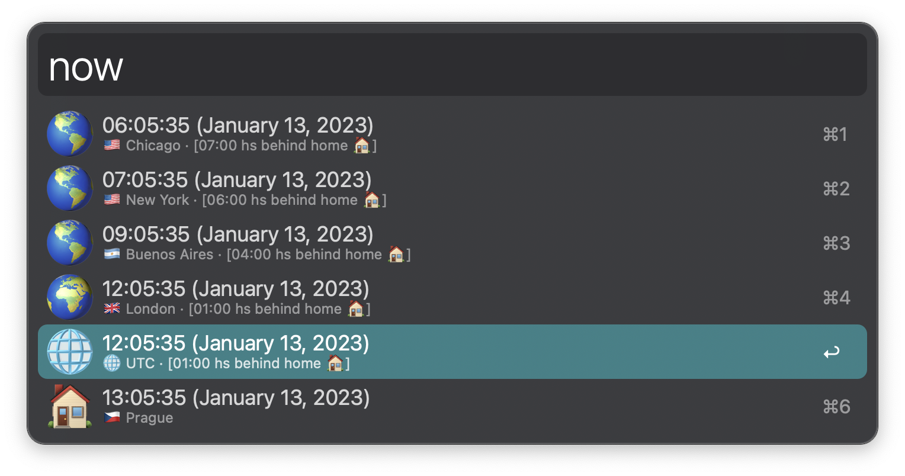
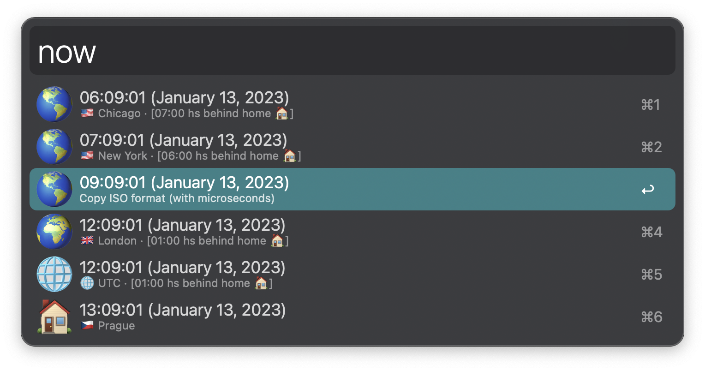
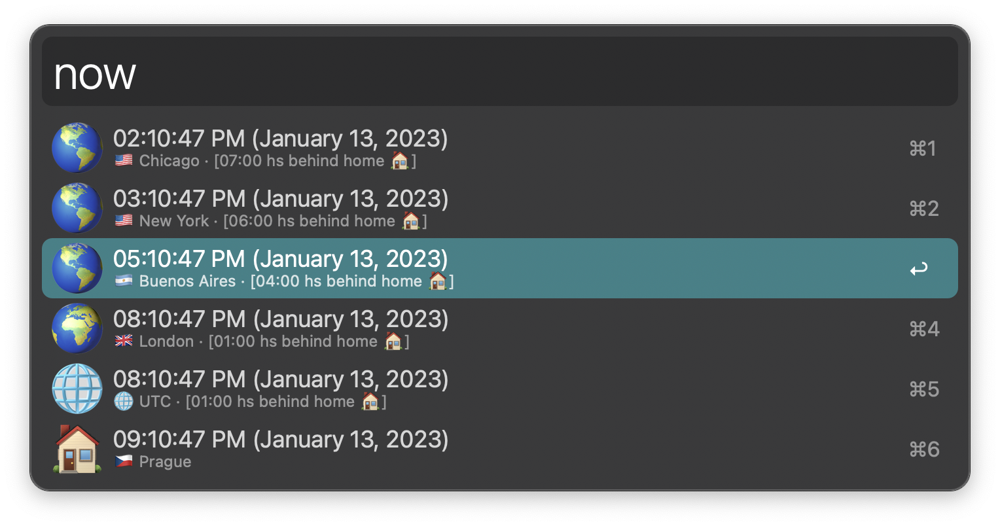
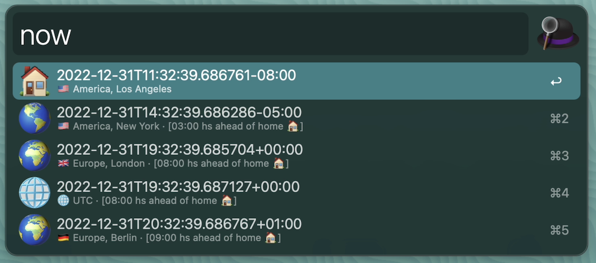
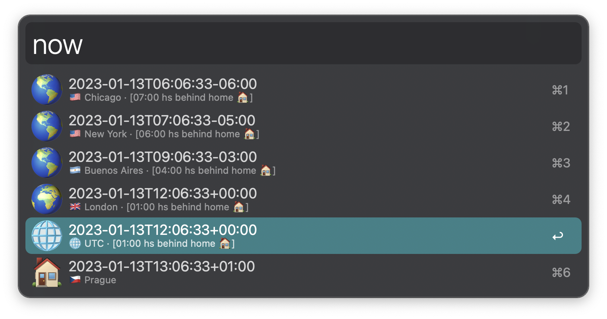

## ALFRED-WORLD-CLOCK

[Alfred Workflow](https://www.alfredapp.com/workflows/) to check time in multiple timezones. 🌐️

> timezone data provided by [timezonedb](https://timezonedb.com).

#### Configuration:

#### Usage:

##### Default Format

- Hold `alt` to copy ISO with microseconds

- Hold `cmd` to copy ISO without microseconds

##### AM/PM format

##### ISO Format (with microseconds)

##### ISO Format (without microseconds)

