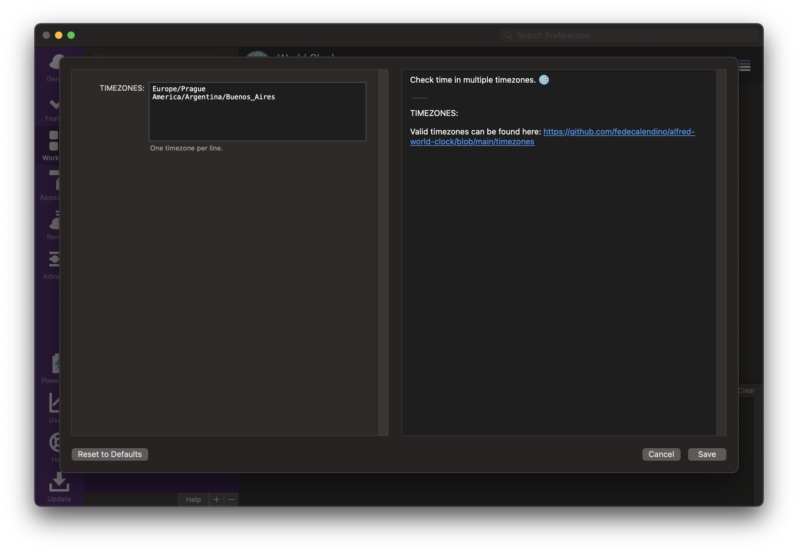

## ALFRED-WORLD-CLOCK

[Alfred Workflow](https://www.alfredapp.com/workflows/) to check time in multiple timezones. 🌐️

#### Configuration:

TIMEZONES:

Valid timezones can be found here: https://github.com/fedecalendino/alfred-world-clock/blob/main/timezones

#### Usage:

