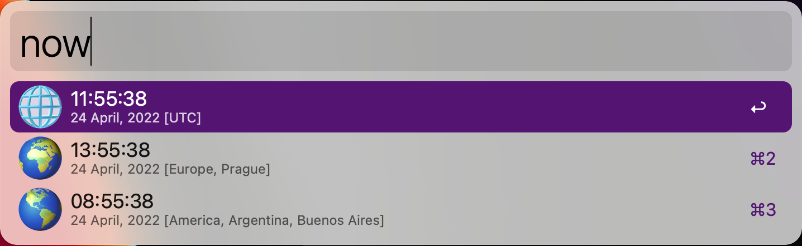

## ALFRED-WORLD-CLOCK

[Alfred Workflow](https://www.alfredapp.com/workflows/) to check time in multiple timezones. 🌐️

#### Configuration:

#### Usage:

##### Default Format

- Hold `alt` to copy ISO with microseconds

- Hold `cmd` to copy ISO without microseconds

##### ISO Format (with microseconds)

##### ISO Format (without microseconds)

